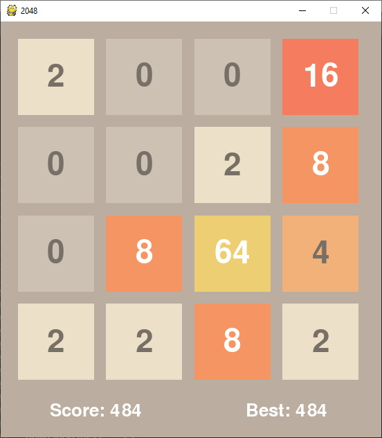

# Python 2048 Recreation

Started on 2/26/2020, revisited/finished on 5/31/2020 at 6:50 PM.

>*Set up Pygame to run the code:* [Add Pygame](https://stackoverflow.com/questions/28453854/add-pygame-module-in-pycharm-id)